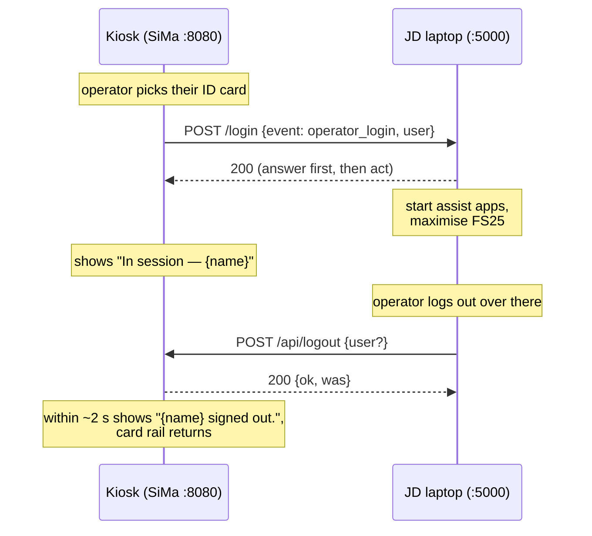

# Handoff — how the welcome kiosk and the JD laptop talk

Two machines, two messages, both plain HTTP POSTs carrying JSON. No
authentication, no message queue, no retries in the background — this runs on
a closed demo network, and every failure is shown to the operator instead of
hidden. This note is for whoever wires the JD laptop side.

## The machines

| Machine | Address | Listens on | Role |
|---|---|---|---|
| SiMa board ("the kiosk") | `192.168.94.15` | port `8080` | Shows the login screen; sends sign-ins; receives logouts |
| JD laptop | `192.168.94.122` | port `5000` | Runs FS25 + assist app; receives sign-ins; sends logouts |

The board's IP is DHCP-assigned — if the kiosk stops answering, check it with
`hostname -I` on the board and update whatever the JD side has hardcoded.
The JD laptop's address lives in `.env` on the board (`WELCOME_JD_URL`,
currently `http://192.168.94.122:5000/login`); it is re-read on every send,
so editing `.env` needs no restart.



## Message 1 — sign-in (kiosk → JD laptop)

**When:** the moment an operator taps their ID card, or finishes signing up
with the blank card. Sent by `welcome_login/handoff.py` on the board.

**What:** one POST to `http://192.168.94.122:5000/login`

```json
{
  "timestamp": "2026-08-11T00:12:29.123456",
  "event": "operator_login",
  "new_user": false,
  "user": {
    "id": "priya-sharma",
    "name": "Priya Sharma",
    "created_at": "2026-08-10T18:02:11+00:00",
    "last_seen": "2026-08-11T00:12:29+00:00"
  }
}
```

- `event` is always the literal `operator_login`.
- `new_user` is `true` when this person signed up with the blank card just
  now — use it if first-timers should get a different start (e.g. the
  simulator walkthrough instead of the menu).
- `user.id` is the stable identifier (lowercased, hyphenated name);
  `user.name` is what to display.

**What the kiosk expects back:** any 2xx status within 5 seconds
(`WELCOME_JD_TIMEOUT_S`). The body is ignored. **Answer 200 immediately,
then act** — if the listener starts apps before responding, the kiosk times
out and reports a failure that didn't happen.

**On failure** (timeout, refused, non-2xx): the operator stays signed in on
the kiosk, and the session screen shows "Could not reach the JD laptop" with
a **Try again** button. Try again re-sends the *identical* payload — so the
JD listener must tolerate receiving the same sign-in twice (second one wins,
or is ignored if that operator's stations are already up).

**The listener:** yours, or the included fallback —
`jd_receiver/receiver.py` (stdlib only). It answers 200 at once, runs the
commands in `receiver_config.json`, then waits for windows by title and
maximises each on its configured monitor. Windows Firewall must allow Python
to accept inbound connections on port 5000 (it prompts on first run — Allow).

## Message 2 — logout (JD laptop → kiosk)

**When:** the operator ends their session on the JD laptop. The JD side owns
this decision entirely; the kiosk just waits to be told.

**What:** one POST to `http://192.168.94.15:8080/api/logout`. The body is
optional; sending the name makes the sign-out notice show it:

```json
{ "user": { "name": "Priya Sharma" } }
```

An empty `{}` (or no body) also works — any POST to that path ends whatever
session is active.

**Response:** `{"ok": true, "was": "Priya Sharma"}` — `was` is who had been
signed in, `null` if nobody was.

**What happens on the kiosk:** the page polls its session every 2 seconds,
so within a couple of seconds it shows "{name} signed out." and returns to
the ID-card rail for the next person. If the JD side can never send this,
the session screen's "Sign out on this screen" button is the manual fallback.

## Asking instead of telling

- `GET http://192.168.94.15:8080/api/session` → who is signed in right now:
  `{"user": {...}|null, "since": ..., "handoff": {...}, "last_event": {...}}`.
  Useful on the JD side before deciding to start anything.
- `GET http://192.168.94.122:5000/health` → `{"ok": true}` if the fallback
  receiver is up.

## Proving the pipe works

From the board, before the demo:

```bash
curl http://192.168.94.122:5000/health
```

From the JD laptop (PowerShell — note `curl` there is an alias, use
`Invoke-RestMethod` or `curl.exe`):

```powershell
Invoke-RestMethod -Method Post -Uri http://192.168.94.15:8080/api/logout `
  -ContentType "application/json" -Body '{}'
```

If the first returns `{"ok": true}` and the second flips the kiosk back to
the card rail, both directions work.

## Where each piece lives

| Piece | File |
|---|---|
| Sends the sign-in | `welcome_login/handoff.py` |
| Receives the logout, owns the session | `welcome_login/api.py` (`logout()`, `session()`) |
| HTTP routes on the kiosk | `welcome_login/bundle_server.py` (`/api/*`) |
| Fallback listener for the JD laptop | `jd_receiver/receiver.py` + `receiver_config.json` |
| Addresses | `.env` on the board (`WELCOME_JD_URL`) |
